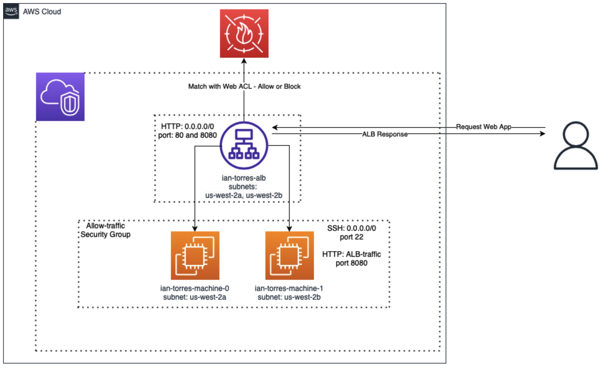

# EC2-WAF_terraform
A repo to house EC2 and WAF terraform automation

### Infrastructural Diagram
> Note: This infrastructural diagram notes that port 22 is open for this deployment, but it will not be open by default unless the Security group rule for port 22 traffic is uncommented from the `main.tf` terraform file



### Problem Explanation
Based on the requirements document, we need to create infrastructure to house and serve a web application using two Amazon EC2 instances, whose only entry point (besides SSH if maintenance is needed on the EC2) is through the ALB via HTTP on port 8080.

The following procedure was used to accomplish these requirements:
1. Deploy Amazon EC2 instances with a user data script that installs Flask and creates a simple Flask web application that will later be run on port 8080
2. Deploy AWS Security Groups to section off traffic based on the source origin of the traffic (be it the user communicating with the ALB and the ALB communicating with the EC2 instances) and opening port 8080 on the EC2 instance
3. Deploy AWS ALB w/ ALB listener to allow the end user to communicate with the Flask web application (an ALB listener allows the end user to communicate with the Flask app via port 8080)
4. Deploy the AWS LB target group. This target group is used to specify where the ALB should route the traffic to when it receives valid incoming requests to connect to the Flask web application.
5. Deploy the WAF Web ACL. The second, if not the first, most critical piece of infrastructure for this web application deployment. Using WAF Web ACL, we are able to block traffic from outside of the US from communicating with our web application (full stop - if need be we can also include the ability to block VPN identified IP addresses to ensure end users cannot connect to our web application via a VPN), and stop other "common attacks" being utilized against our web application. Rate limiting blocks were also utilized in order to protect against unauthorized "login" attempt requests.

### How to deploy the Terraform automation

> Note: This procedure assumes that the AWS CLI has been installed on your system, if it has not please refer to this [reference documentation](https://docs.aws.amazon.com/cli/latest/userguide/getting-started-install.html).

0. Open up a Terminal application
1. Ensure your AWS CLI credentials are located in your `.aws` credentials file (i.e `/Users/itorres/.aws/credentials`)
2. Ensure your AWS config has also been set to use the correct region specified in the requirements document (i.e. `/Users/itorres/.aws/config`)

> Note: The terraform automation will not work correctly if the paths to the files noted in steps 1 and 2 of this section are not changed to reflect where your `credentials` and `config` file are located on your system.

3. Confirm that terraform has been installed on your system

> Note: If terraform has not been installed on your system please refer to this [reference document](https://developer.hashicorp.com/terraform/tutorials/aws-get-started/install-cli) for details on how you can install it on your local system)

4. Run this command to initialize the terraform deployment repository on your local system

```
prompt> terraform init
```

5. Run this command to validate that the terraform code has valid syntax

```
prompt> terraform validate
```

6. Run this command to see what infrastructure will be created using your terraform automation code

```
prompt> terraform plan
```

7. Run this command to deploy the terraform automation

```
prompt> terraform apply
```

> Note: You will need to type in `yes` and hit `<ENTER>` in order for the terraform automation to be deployed to AWS

8. Once the terraform code has finished running copy the `alb_dns` output value from the terminal and navigate to the address using a web browser, and append `/login` to test that the "login" endpoint functions as well

### Tools used for deployment

* AWS Console: Confirming Resources and Infrastructure were stood up correctly (see requirements document for UI login details)
* AWS CLI: Acquiring AWS access credentials to be used for terrform deployments (see requirements document for AWS CLI Credentials)
* Homebrew: Mac OS package manager used to install terraform on Mac OS
* Terraform: Infrastructure as Code (IaC) tool used to automate AWS infrastructure deployments
* Git: Used for version control (terraform code)
* Mac OS Terminal: Application used to deploy terraform code into AWS and SSH into Amazon EC2
    
    * SSH'ing into the EC2 was critical in solving why the python simple http server was not deploying in Amazon Linux 2023 (turns out there is an odd bug that does not allow the user data script to run successfully when the server is being stood up)

        * Needed to check the /var/log/cloud-init-output.log file to see what happened to the EC2 user data script
        * Needed to check the web application server logs to see if Flask installed successfully and if the web application started

    * Used to push code to GitHub Repository
* Visual Studio Code: Text editor that was used to create terraform code, and track new changes to the repository before code was committed to Git.
* Flask: Used to create a very simple Web Application with two endpoints 

    * `'/'`: 'Hello World!' - root endpoint
    * `'/login'`: 'Trying to login?' - login endpoint - used to test WAF configuration line item 'c' (see requirements document))

* Terraform Docs: Provided reference for properties that were required for specific resource automation
* draw.io: Used to create the Infrastructure Diagram

